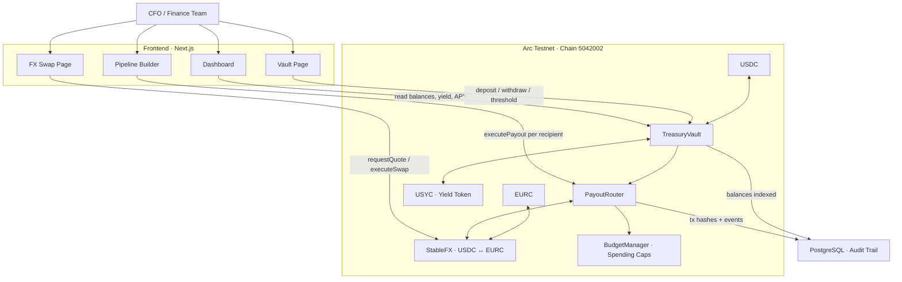

# ArcVault

Enterprise Treasury & FX Operations Platform on Arc blockchain. ArcVault lets finance teams deposit idle USDC into a yield-bearing vault (via USYC), execute instant cross-currency payouts (via Circle StableFX), and orchestrate complex fund flows through a visual drag-and-drop pipeline builder — all enforced by on-chain smart contracts.

---
  
  
## Architecture



---

## Smart Contracts

All contracts are deployed on Arc Testnet (chain ID `5042002`) using Foundry.

### TreasuryVault

Core vault holding USDC liquidity and USYC yield positions.

| Function | Access | Purpose |
|----------|--------|---------|
| `depositFunds(amount)` | Public | Accept USDC; auto-sweep to USYC if balance exceeds threshold |
| `withdrawFunds(amount)` | TREASURY_MANAGER | Withdraw USDC; auto-redeem USYC if liquid balance is insufficient |
| `setLiquidityThreshold(amount)` | CFO | Update the sweep threshold and rebalance |
| `sweepToUSYC()` | Public | Manually convert excess USDC to USYC |
| `redeemFromUSYC(amount)` | Public | Manually convert USYC back to USDC |
| `rebalance()` | Public | Sweep or redeem to match the target threshold |
| `getLiquidBalance()` | View | USDC held in the vault |
| `getTotalValue()` | View | Liquid USDC + USYC valued at current exchange rate |
| `getYieldAccrued()` | View | Total value minus net deposits (i.e. profit from yield) |

### PayoutRouter

Orchestrates the full payout lifecycle: withdraw from vault, optionally convert currency, settle to recipient.

| Function | Access | Purpose |
|----------|--------|---------|
| `executePayout(recipient, amount, currency, ref)` | AP_MANAGER | Single payout with optional FX conversion |
| `batchPayout(recipients[], amounts[], currencies[], refs[])` | AP_MANAGER | Multiple payouts in one transaction |

**Payout lifecycle:** `Pending → Processing → Converting (if FX needed) → Settling → Completed`

Each payout emits a `PayoutCreated` event with an on-chain ID used for DB tracking.

### BudgetManager

On-chain department spending limits.

| Function | Access | Purpose |
|----------|--------|---------|
| `createBudget(name, head, allocation, end)` | CFO | Create a time-bound budget for a department |
| `spendFromBudget(budgetId, amount, ref)` | Department Head | Debit the budget (reverts if over-allocated) |
| `reallocate(fromId, toId, amount)` | CFO | Move unspent funds between departments |

### Roles (AccessControl)

| Role | Granted To | Can Do |
|------|-----------|--------|
| `DEFAULT_ADMIN_ROLE` | Deployer | Pause/unpause, grant roles |
| `CFO_ROLE` | Deployer | Set threshold, create/reallocate budgets |
| `TREASURY_MANAGER_ROLE` | PayoutRouter, BudgetManager | Withdraw from vault |
| `AP_MANAGER_ROLE` | Deployer | Execute payouts |

---

## USYC & StableFX

### USYC — Yield on Idle Treasury

USYC is a yield-bearing token that wraps USDC. Depositing USDC mints USYC at the current exchange rate; as yield accrues the rate increases, so redeeming later returns more USDC than was deposited.

**How ArcVault uses it:**

```
Deposit $150k USDC → Vault balance = $150k
Threshold = $100k  → Excess = $50k
Auto-sweep         → $50k USDC converted to ~48 USYC (rate 1.048)
                     Vault now: $100k liquid + 48 USYC earning ~5% APY

Later: withdrawal of $120k requested
  Liquid = $100k (not enough)
  Redeem $20k worth of USYC → receive $20k USDC (rate may have grown)
  Transfer $120k to recipient
```

The vault's `getTotalValue()` and `getYieldAccrued()` views let the dashboard show real-time AUM and earned yield without any off-chain calculation.

**Interface (`IUSYC`):**

| Function | Purpose |
|----------|---------|
| `deposit(usdcAmount)` | Mint USYC at current rate |
| `redeem(usycAmount)` | Burn USYC, receive USDC at current rate |
| `exchangeRate()` | Current USYC/USDC rate (starts at 1e18, grows over time) |
| `balanceOf(account)` | USYC token balance |

### StableFX — Foreign Exchange

StableFX provides instant stablecoin conversions using a Request-for-Quote (RFQ) model. ArcVault uses it when a payout's target currency differs from USDC.

**How ArcVault uses it:**

```
Pipeline payout: send €5,000 to contractor in Berlin
  1. StableFX.requestQuote(USDC, EURC, $5,415)
     → quoteId, outputAmount = €5,000, rate = 0.9235, expires in 30s
  2. StableFX.executeSwap(quoteId)
     → Atomic swap: pull USDC, send EURC
  3. Transfer €5,000 EURC to contractor wallet
```

**Interface (`IStableFX`):**

| Function | Purpose |
|----------|---------|
| `requestQuote(from, to, amount)` | Get a quote with rate, output amount, and 30s expiry |
| `executeSwap(quoteId)` | Execute the quoted swap atomically |
| `setRate(from, to, rate)` | (Admin) Configure pair rates |

**Configured rates:** USDC→EURC = 0.9235, EURC→USDC = 1.0828

---

## Pipeline Engine

The pipeline builder lets users visually wire up complex fund flows as a directed acyclic graph. The engine topologically sorts the nodes and executes them in dependency order, persisting progress to the database after each step.

```
[Treasury] ──→ [Engineering Dept] ──→ [Alice: $5k USDC]
                                  ──→ [FX: USDC→EURC] ──→ [Bob: €4k EURC]
           ──→ [Approval Gate] ──→ [Marketing Dept] ──→ [Carol: $3k USDC]
```

### Node Types

| Node | Purpose | Key Behavior |
|------|---------|-------------|
| **Treasury Source** | Entry point — verifies vault has sufficient liquidity | Reads `TreasuryVault.getLiquidBalance()` on-chain; outputs the current liquid USDC balance |
| **Department** | Routing/grouping node representing a cost center (e.g. "Engineering") | Pass-through — no on-chain action; organizes downstream recipients under a label |
| **FX Conversion** | Currency conversion for non-USDC payouts | Sums all downstream recipient amounts, requests a StableFX quote, executes the swap, and persists the FX record to the database |
| **Employee / Contractor** | Individual payout to a wallet address | Calls `PayoutRouter.executePayout()` on-chain, waits for confirmation, decodes the `PayoutCreated` event, and records the payout + transaction in the database. Supports optional gift/bonus amounts |
| **Approval** | Multi-signature gate — pauses execution until M-of-N approvers sign off | Checks the database for existing approvals; if the threshold is met, continues; otherwise creates pending `ApprovalRequest` records and pauses the pipeline with status `AWAITING_APPROVAL` |
| **Condition** | Branching logic based on upstream data | Evaluates a rule (e.g. `amount > 50000`) against parent node values; marks the untaken branch's descendants as skipped |
| **Delay** | Timed pause — wait a duration or until a specific date/time | If the resume time has already passed, continues immediately; otherwise creates a `DelaySchedule` record and pauses the pipeline with status `PAUSED` |

### Execution Rules

- Nodes execute in **topological order** (dependencies first)
- If a node **fails**, all its downstream children are **skipped**
- If an **approval gate** is not satisfied, the pipeline **pauses** and can be resumed later via API
- If a **condition** evaluates to false, the false-branch descendants are **skipped**
- Progress is **persisted to the database** after every node so the frontend can poll and show real-time status
- Final status is `COMPLETED`, `PARTIAL_FAILURE`, or `FAILED` based on how many nodes succeeded

---

## Frontend

Built with Next.js 14 (App Router), React 18, Tailwind CSS, wagmi/viem for on-chain reads and writes, RainbowKit for wallet connection, React Flow for the pipeline canvas, and Recharts for data visualization.

### Pages

**Dashboard** (`/`) — Executive overview with six KPI cards (Total AUM, Yield Earned, APY, Liquid USDC, USYC Position, Pending Payouts), a yield-over-time area chart, and an asset allocation pie chart. All balances are read directly from the TreasuryVault contract via multicall and refresh every 30 seconds.

**Treasury Vault** (`/vault`) — Full vault management. An action bar at the top provides Deposit, Withdraw, Sweep (USDC to USYC), and Redeem (USYC to USDC) buttons that open modal flows. Below that: a yield performance section with a period selector and SVG chart, a liquidity allocation panel with a stacked bar showing the USDC/USYC split and an adjustable threshold slider, and a paginated transaction history table.

**FX Conversion** (`/fx`) — A centered swap card inspired by Uniswap. The user selects a currency pair (USDC/EURC), enters an amount, and sees a live quote with exchange rate, spread, and a 30-second countdown timer. Supports both on-chain swaps (via StableFX contract with ERC-20 approve flow) and off-chain API swaps.

**Pipeline Builder** (`/pipeline`) — Three-column layout. The left sidebar contains a block palette with six draggable node types grouped into Recipients (Department, Employee, Contractor) and Flow Control (Approval, Condition, Delay), plus a list of saved pipeline configurations. The center is a React Flow canvas where users drop nodes, connect them with edges, and configure each node's parameters inline. The right panel shows real-time execution logs during a pipeline run. A second tab shows execution history.

### Pipeline Canvas

Nodes are dragged from the block palette onto the canvas using the HTML5 drag API. Each node type has a custom React component with color-coded styling:

| Node | Color |
|------|-------|
| Treasury Source | Gold |
| Department | Gold with utilization bar |
| Employee | Green |
| Contractor | Tan |
| Approval | Purple |
| Condition | Cyan (two output handles: True/False) |
| Delay | Blue |

During execution, nodes animate through status colors: gray (pending) → gold pulse (processing) → green (completed) or red (failed). Approval nodes pulse purple while awaiting signatures. The execution log streams entries in real-time by polling the server every 2 seconds and syncing state through a Zustand store.

### Key Hooks

| Hook | Purpose |
|------|---------|
| `useVaultBalances` | On-chain multicall reading 5 vault values (liquid, USYC, total, yield, threshold); polls every 30s |
| `useUserUSDCBalance` | Reads user's wallet USDC balance via ERC-20 `balanceOf`; polls every 15s |
| `useDeposit` | Two-step mutation: `USDC.approve()` then `TreasuryVault.depositFunds()` |
| `useWithdraw` | Calls `TreasuryVault.withdrawFunds()` |
| `useSetThreshold` | Calls `TreasuryVault.setLiquidityThreshold()` (CFO only) |
| `useFXQuote` | Fetches live FX quote with 25s stale time; auto-refreshes before 30s expiry |
| `useOnChainSwap` | On-chain FX: `USDC.approve()` then `StableFX.executeSwap()` |
| `useExecutePayout` | Calls `PayoutRouter.executePayout()` |
| `useBatchPayout` | Batch payout execution |
| `usePipelineExecution` | Polls active pipeline execution status every 2s |
| `useApprovalSign` | Signs approval messages (EIP-191) for pipeline approval gates |
| `useDashboardStats` | Aggregated dashboard metrics from API |
